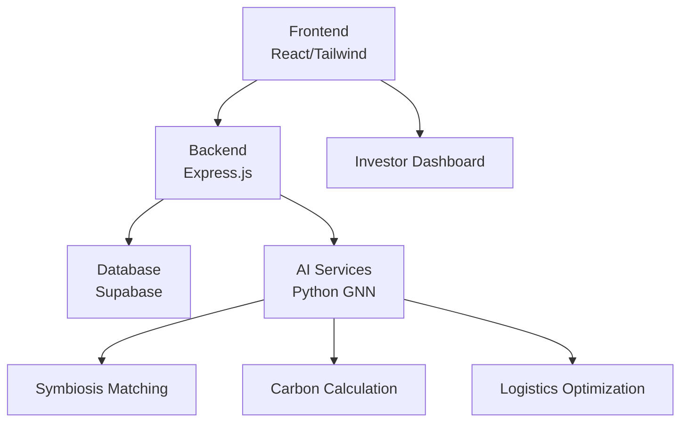
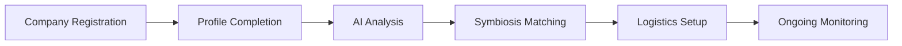
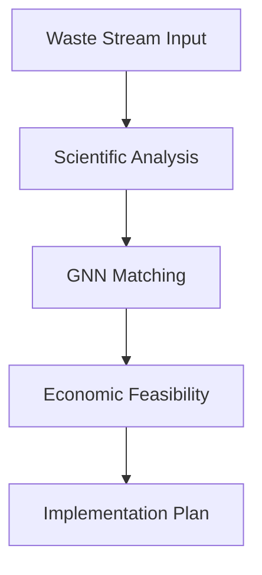
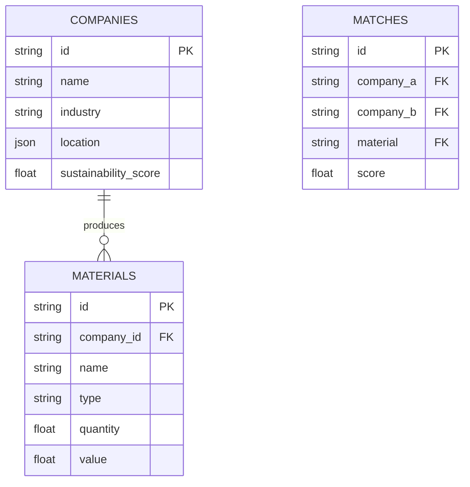
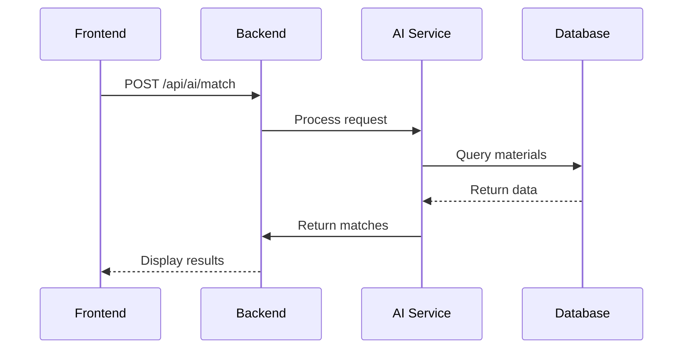

# Industrial Symbiosis AI Platform - System Architecture

## 1. System Overview


## 2. Technology Stack

| Layer          | Technology                 | Version       | Purpose                          |
|----------------|----------------------------|---------------|----------------------------------|
| **Frontend**   | React                      | 18.2          | UI Components                    |
|                | TypeScript                 | 5.0           | Type Safety                      |
|                | Tailwind CSS               | 3.3           | Styling                          |
| **Backend**    | Express.js                 | 4.18          | API Server                       |
|                | Node.js                    | 20.0          | Runtime                          |
| **Database**   | Supabase                   | 2.0           | PostgreSQL Interface             |
| **AI Core**    | Python                     | 3.10          | ML Services                      |
|                | PyTorch Geometric          | 2.3           | GNN Implementation               |
| **DevOps**     | Docker                     | 24.0          | Containerization                 |
|                | GitHub Actions             | -             | CI/CD Pipelines                  |

## 3. Key Processes

### Company Onboarding Flow


### Material Matching Process


## 4. Database Schema



## 5. API Endpoints

### AI Services
| Endpoint               | Method | Description                          |
|------------------------|--------|--------------------------------------|
| `/api/ai/match`        | POST   | Find symbiosis matches               |
| `/api/ai/portfolio`    | POST   | Generate company portfolio           |
| `/api/ai/optimize`     | POST   | Optimize material exchanges          |

### Sustainability
| Endpoint                   | Method | Description                          |
|----------------------------|--------|--------------------------------------|
| `/api/carbon/calculate`    | POST   | Calculate carbon impact              |
| `/api/waste/analysis`      | POST   | Analyze waste streams                |

### Logistics
| Endpoint                   | Method | Description                          |
|----------------------------|--------|--------------------------------------|
| `/api/logistics/rates`     | GET    | Get shipping rates                   |
| `/api/logistics/schedule`  | POST   | Schedule material transport          |

## 6. Component Interactions



## 7. Error Handling Strategy

```mermaid
graph TD
    A[Request] --> B{Valid?}
    B -->|Yes| C[Process]
    B -->|No| D[Return 400]
    C --> E{DB Error?}
    E -->|No| F[Return 200]
    E -->|Yes| G[Retry x3]
    G --> H{Success?}
    H -->|Yes| F
    H -->|No| I[Return 503]
