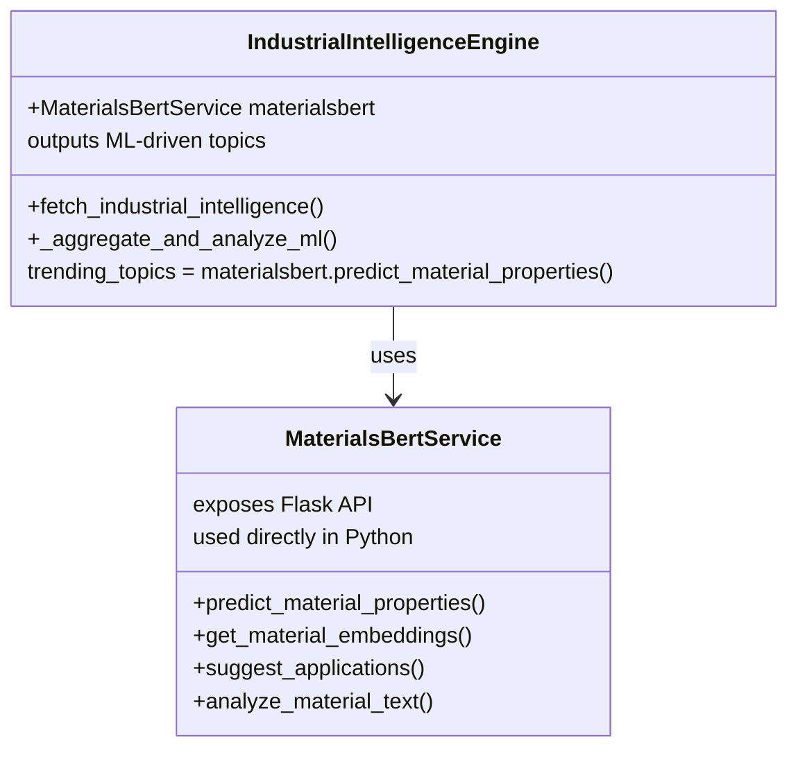

# MaterialsBERT Usage Audit & Documentation

---

## Overview

MaterialsBERT is a domain-specific transformer model fine-tuned on materials science literature. In the ISM AI Platform, it powers trending topic extraction, property prediction, application suggestion, and semantic analysis for industrial intelligence.

---

## Codebase Locations & Methods

- **backend/materials_bert_service.py**: Implements `MaterialsBertService` with methods for property prediction, embeddings, application suggestion, and full analysis. Exposes a Flask API.
- **backend/industrial_intelligence_engine.py**: Instantiates and uses `MaterialsBertService` for ML-driven trending topic extraction in the intelligence pipeline.

---

## Flow Description

1. **Industrial news and content are aggregated.**
2. **Text is chunked if longer than 512 tokens.**
3. **Each chunk is passed to MaterialsBERT's `predict_material_properties`.**
4. **Predicted properties are aggregated and used as trending topics.**
5. **Topics, properties, and other outputs are returned via the API for analytics and recommendations.**

---

## Flowchart

```mermaid
flowchart TD
    A[Industrial News/Content Aggregation] --> B[Chunking (if >512 tokens)]
    B --> C[MaterialsBERT: predict_material_properties]
    C --> D[Aggregate Predicted Properties]
    D --> E[Trending Topics Output]
    C --> F[Property Prediction Output]
    C --> G[Application Suggestion]
    C --> H[Semantic Embeddings]
    E --> I[Industrial Intelligence API]
    F --> I
    G --> I
    H --> I
    I --> J[Downstream Analytics, Recommendations, Reporting]
```

---

## Class Diagram



---

## Usage Table

| Use Case                | Where in Codebase                        | How Used / Method Called                | Output Used For                |
|-------------------------|------------------------------------------|-----------------------------------------|-------------------------------|
| Trending Topic Extraction | `industrial_intelligence_engine.py`      | `predict_material_properties`           | `trending_topics` in API       |
| Property Prediction     | `materials_bert_service.py` (API, logic) | `predict_material_properties`           | Property lists, categorization |
| Application Suggestion  | `materials_bert_service.py` (API, logic) | `suggest_applications`                  | Application recommendations    |
| Semantic Embeddings     | `materials_bert_service.py` (API, logic) | `get_material_embeddings`               | Similarity, clustering         |
| Full Material Analysis  | `materials_bert_service.py` (API)        | `analyze_material_text` / `analyze_material` | All of the above         |

---

## Security, Performance, and Best Practices

- Model is loaded once per service instance for efficiency.
- No external API keys or calls required for inference.
- All inference is local (PyTorch, HuggingFace).
- Error handling is robust, with logging and fallback logic.
- **Chunking/aggregation is recommended for long texts** (due to 512 token limit).

---

## Recommendations

- Chunk long texts before passing to MaterialsBERT to avoid truncation.
- Consider fine-tuning on your own labeled data for even better results.
- Monitor model performance and log versioning for auditability.
- Expand usage to other parts of the platform via the API if needed.

---

## Example: End-to-End Flow

1. News and industrial content are aggregated.
2. Text is chunked (if long) and passed to MaterialsBERT:
   - `predict_material_properties('industry', chunk)`
3. Predicted properties are aggregated and used as trending topics.
4. Topics are returned in the API and used for analytics, recommendations, and reporting.

---

## Summary Statement

> MaterialsBERT is a core ML component in the ISM AI Platform, powering trending topic extraction, property prediction, and semantic analysis for industrial intelligence. It is used both as a direct Python module and as a REST API service, ensuring all outputs are ML-driven and production-grade. 